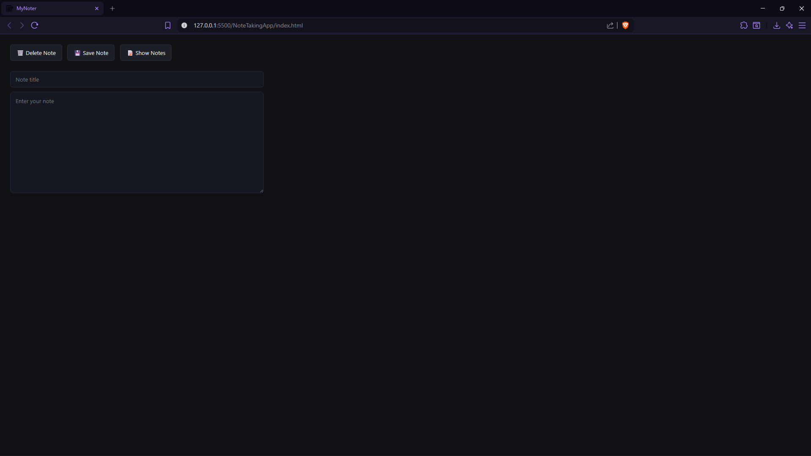
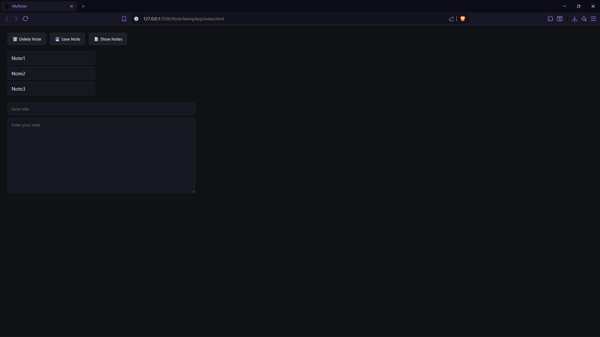
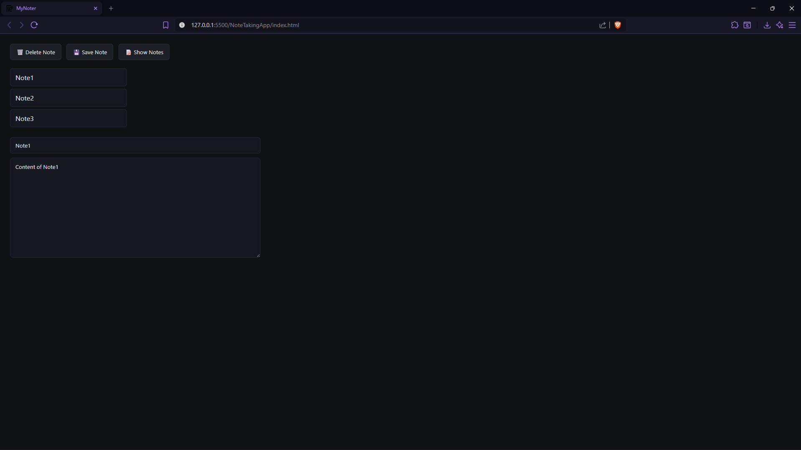

# MyNoter

A minimal, offline-first note-taking web app built with pure HTML, CSS, and JavaScript.  
No frameworks. No backend. No accounts. Your notes live in your browser.

The app is designed around one idea:  
**Structure your thoughts, then navigate them.**

---
## Screenshots

### Empty State


### Notes Index


### Opened Note


## Features

- Create notes with a **title + body**
- Persist notes using `localStorage`
- View all saved notes as a list of titles
- Click a title to open that note
- Delete the currently opened note
- Clean two-pane layout:
  - Left: note index
  - Right: editor
- Fully client-side, works offline

---

## How It Works

Data is stored in the browser as an array of objects:

```js
[
  { title: "Idea", body: "Build a note app" },
  { title: "Todo", body: "Finish UI" }
]
```
<b>Flow:</b>

- Write a title and note.

- Click Save → note is pushed into storage.

- Click Show Notes → titles are rendered in the sidebar.

- Click a title → that note loads into the editor.

- Click Delete → the currently open note is removed.

<b> State is tracked using: </b>
``` js
let currentIndex = null;
```
This ensures deletion is precise and intentional.

### Tech Stack
- HTML – structure
- CSS – layout & dark UI
- JavaScript – state, DOM, persistence
- ``` localStorage ``` – data layer
No dependencies.

### Run Locally
Just open ``` index.html ``` in a browser.
No build step. No server.

### Philosophy
This project is not about features.
It is about understanding:
- DOM as a state surface
- Storage as serialized truth
- UI as a projection of data
- Explicit state over implicit behavior
  
It is a small system that behaves like a real product.
